# ThinkAlike Onboarding Guide
Connecting like minded individuals.

Welcome to the ThinkAlike project! This guide provides an overview of the project, its goals, and how you can contribute.

## Project Overview

ThinkAlike is a transformative, open-source platform that utilizes AI to foster **authentic human connections** based on shared values, interests, and lifestyles. We aim to revolutionize how individuals interact online and in the real world by promoting a human-centered, ethical, and transparent digital experience. We're building a system where users can:

*   **Discover themselves:** Explore their values, beliefs, and aspirations.
*   **Connect with like-minded individuals:** Find others who share similar values and goals.
*   **Build meaningful relationships:** Transition online interactions into real-world connections.
*   **Contribute to a better future:** Participate in a community dedicated to ethical AI and responsible technology.
*   **Collaborate and build communities:** Create new ways to build real-world connections, empowered by technology that always respects user agency and freedom.

Our core objective is to build high-performing, ethically sound, and user-centered technology, where:

*   **AI assists, not replaces, human agency:** AI acts as a tool to empower user exploration and decision-making, with data transparency as a guiding principle.
*   **UI validates workflow integrity:** The UI serves not just as a visual interface, but also as a validation tool to showcase data flows, system behavior, and architectural implementation choices.
*   **Data workflows enhance code and AI:** Data-driven workflows are central to our design, guiding code implementation and AI responses based on ethical considerations.

ThinkAlike empowers a global community to build a more human and meaningful digital world, grounded in strong ethical connections and core values.

### 1.1. Core Goals for MVP Implementation:

The ThinkAlike platform’s MVP implementation is designed to test these core goals across all architectural layers, with a focus on creating an action-driven ethical workflow framework.

Every technological component of our AI data integration plan is purpose-built to empower users with self-awareness during interactions. By gathering feedback at every process and component level, user input shapes the evolution of our ethical AI systems.

ThinkAlike transforms technology into a tool that respects individuality and enhances personal choices to find a place to belong, with AI transparency as a guiding framework.

Our MVP aims to demonstrate that:

*   **Technology enhances user freedom:** Technology empowers users to make informed choices and control their digital experience.
*   **Data is a tool for empowerment:** Data is used transparently to provide valuable insights and to enhance user agency, not to manipulate or control users.
*   **UI validates ethical implementation:** The UI serves as a "validation framework component” to better align code implementation with real user experience, and to ensure ethical data handling practices.

## Core Values

ThinkAlike is built on the following core values:

*   **Human-Centered Approach:** Prioritizing human dignity, agency, and well-being above all else. Technology serves to enhance human capabilities and connections.
*   **Ethical AI:**  Ensuring AI is used responsibly and ethically, with a focus on user control and bias mitigation.
*   **Transparency & Traceability:** Building trust through open data workflows and code auditability. Radical transparency is a cornerstone of our approach.
*   **User Empowerment:**  Giving users control over their data, their choices, and their experience on the platform.  This includes *individual and collective* empowerment.
*   **Authenticity:** Fostering genuine, value-based relationships and interactions.
*   **Community:**  Building a collaborative and supportive community of contributors and users.
*   **Inclusivity:** Creating accessible and ethical technology for all users, regardless of background or technical expertise.
*   **Privacy & Security:** Implementing strong security measures to protect user data and privacy.
*   **Bias Mitigation:** Actively working to detect and mitigate biases in AI models and algorithms.

These values are **integral to every aspect of the ThinkAlike project** and are actively validated through:

* **User-Centric UI/UX Design:** Prioritizing user control, intuitive navigation, and clear communication.
* **AI as Augmentation of Human Intelligence:** AI empowers informed choices, not algorithmic dictates.
* **Ethical Validation in Development Workflows:** Rigorous ethical review processes integrated into development.
* **Explainable AI (XAI) Methodologies:** Ensuring AI decision-making is understandable.
* **Bias Mitigation Protocols:** Proactive measures for bias detection and reduction.
* **Transparency in AI Workflows:** Clear UI implementations of data flows and AI processing.
* **Continuous Ethical Auditing and Validation:** Ongoing monitoring of AI behavior and ethical alignment.
* **UI-Driven Data Flow Visualization:** Making data flows visible and understandable through the UI.
* **Open Source Codebase and Public Repositories:** Ensuring code auditability and community review on GitHub.
* **Comprehensive Documentation of Data Handling Processes:** Publicly available documentation of all data processes.
* **Data Provenance and Lineage Tracking:** Recording and displaying data origin and transformation history.

## Architecture

ThinkAlike follows a modular architecture, with distinct components for the frontend, backend, and AI models.

*   **Frontend:**  Built with React, the frontend provides the user interface and handles user interactions. Key components include:
    *   `frontend/src/components/DataTraceability.jsx`: Visualizes data flow using a nodes map.
    *   `frontend/src/components/ActionButton.jsx`:  A generic action button for triggering various actions.
    *   *(Other components will be added as the project develops)*

*   **Backend:**  The backend is built with Python and FastAPI. It provides a RESTful API for the frontend to interact with. Key files include:
    *   `backend/app/main.py`: The main FastAPI application file.
    *   `backend/requirements.txt`: Lists the backend dependencies.

*   **AI Models:**  AI models are used for personalization, matching, and other intelligent features.  (Details on specific models will be added later.)

```mermaid
graph LR
    subgraph "Presentation Layer (UI)"
        UI[User Interface]
    end

    subgraph "Application Layer (API, Logic)"
        API[API]
        Logic[Business Logic]
        AI[AI Agents]
    end

    subgraph "Data Layer (Database, Storage)"
        DB[Database]
    end

    UI -- Data & Requests --> API
    API -- Processed Data --> UI
    API -- Data Requests --> Logic
    Logic -- Data --> API
    Logic -- Data Requests --> DB
    DB -- Data --> Logic
    AI -- Data Analysis --> DB

    style UI fill:#FFC300,stroke:#333333,stroke-width:2px
    style API fill:#FF5733,stroke:#333333,stroke-width:2px
    style Logic fill:#FF5733,stroke:#333333,stroke-width:2px
    style DB fill:#800000,stroke:#333333,stroke-width:2px
    style AI fill:#001F3F,stroke:#333333,stroke-width:2px
```



The diagram above shows how the UI communicates with the API and how data flows throughout the system.

## Next Steps

Explore additional sections of the documentation to learn about the UI, data handling, and how to contribute to ThinkAlike. Remember to keep your Markdown code blocks well-formed so that mermaid.js can correctly render diagrams.

## Testing

Testing is an integral part of the ThinkAlike development process. We use a variety of testing methodologies, including:

* **Unit Tests:** Testing individual code components.
* **Integration Tests:** Testing interactions between components.
* **UI Tests:** Testing the user interface.
* **User Acceptance Tests (UAT):** Getting feedback from real users.

Below is a small code example of how you can quickly run tests in the backend (assuming a FastAPI + Pytest setup):

```bash
pytest --cov=backend --cov-report=term-missing
```

(More details on testing procedures and how to run tests will be added here.)

## How to Contribute

We welcome contributions from everyone! Here's how to get involved:

1. **Set up your development environment:** Follow the detailed instructions in the Quickstart Guide.
2. **Explore Open Issues:** Check out the Issues tab on our GitHub repository for a list of open tasks. Look for issues labeled "good first issue" or "help wanted".
3. **Introduce Yourself:** Say hello on our communication channels (see below) and let us know your interests and skills.
4. **Fork the Repository:** Create your own fork of the ThinkAlike repository on GitHub.
5. **Create a Feature Branch:** For each contribution, create a new branch from the main branch.
6. **Make Your Changes:** Implement your contribution, following coding style guidelines and best practices.
7. **Commit Your Changes:** Commit your changes with clear and descriptive commit messages.
8. **Push to Your Fork:** Push your branch to your forked repository.
9. **Create a Pull Request (PR):** Submit a Pull Request from your branch to the main branch of the main ThinkAlike repository.
10. **Code Review and Collaboration:** Project maintainers and community members will review your PR, provide feedback, and collaborate with you to get your contribution merged.

## Collaboration and Communication

ThinkAlike thrives on community collaboration. We use the following channels for communication and coordination:

* **GitHub:**
  Our central hub for code collaboration, issue tracking, project management, and documentation.
  [ThinkAlike GitHub Repository](https://github.com/Willeede/thinkalike_project)

* **Discord:**
  For real-time discussions, questions, announcements, and community building.
  [Join our Discord Server](#) (Replace with actual link)

We encourage open communication, constructive feedback, and a collaborative spirit within the ThinkAlike community.

## Key Project Resources and Documentation

Here are essential resources to help you navigate and contribute to ThinkAlike:

* **Quickstart Guide:** `quickstart.md` - Step-by-step instructions for setting up your development environment.
* **ThinkAlike Manifesto:** [Link to Manifesto if available] - Outlines the project's vision and principles.
* **Architectural Design Specifications:** [Link to Architecture Docs if available] - Detailed documentation of the platform's architecture.
* **UI Component Library Documentation:** [Link to UI Component Docs if available] - Documentation for reusable UI components.
* **API Documentation (OpenAPI/Swagger):** [Link to API Docs if available] - Documentation for API endpoints and data schemas.
* **Data Validation Workflows Documentation:** [Link to Data Validation Docs if available] - Documentation on data handling and validation processes.
* **Testing Framework Documentation:** [Link to Testing Docs if available] - Documentation for testing methodologies and frameworks.
* **Ethical Guidelines Documentation:** [Link to Ethical Guidelines if available] - Detailed explanation of ThinkAlike's ethical framework.
* **Style Guide:** `style_guide.md` - Defines the visual style and branding guidelines.

Remember to replace the bracketed placeholders above with the actual links to your documentation files once they exist.

## Actionable Tasks: Your First Steps in ThinkAlike

Ready to start contributing? Here are some actionable tasks to get you going:

1. **Read the ThinkAlike Manifesto and Core Values.**
2. **Introduce Yourself on Communication Channels.**
3. **Set Up Your Local Development Environment** by following the Quickstart file.
4. **Explore the GitHub Repository.**
5. **Pick a “Good First Issue”.**
6. **Explore Existing Code and UI Components.**
7. **Review Project Documentation.**
8. **Start with Documentation or Testing.**
9. **Reach Out with Questions.**
10. **Start Contributing!**

## Conclusion: Build the Revolution with Us!

Congratulations on joining ThinkAlike! You are now part of a growing movement to build a more ethical, transparent, and human-centered digital future. Your contributions, big or small, are valuable and appreciated.

Let's build a better digital world together. Welcome to the ThinkAlike Revolution!
